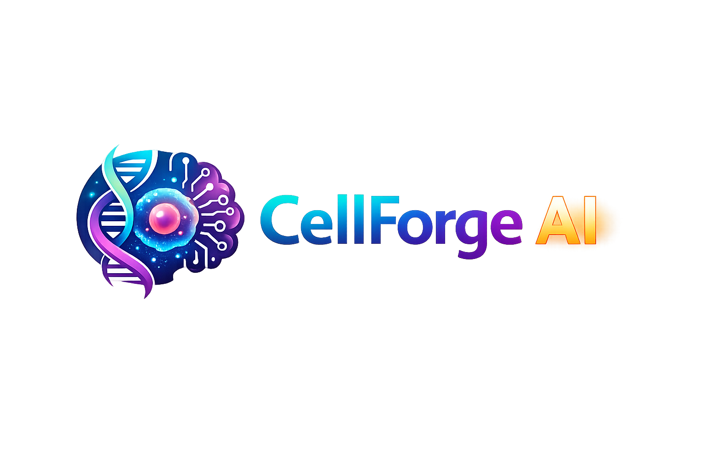

````markdown
# 🧬⚡ CellForge AI  
### *Next-Generation Single-Cell RNA-seq Workflow Platform*

<p align="center">
  
</p>

<p align="center">
<strong>From raw FASTQs to biological insight — powered by AI, modern web apps, and reproducible workflows.</strong>
</p>

<p align="center">


</p>

---

# 🚀 What is CellForge AI?

**CellForge AI** is an advanced full-stack single-cell RNA-seq platform built on top of the trusted **nf-core/scrnaseq** workflow and redesigned for the modern era.

It transforms complex command-line bioinformatics pipelines into a sleek, intelligent web platform where users can:

✅ Upload sequencing data  
✅ Launch workflows visually  
✅ Monitor runs live  
✅ View QC metrics instantly  
✅ Download processed outputs  
✅ Use AI agents for troubleshooting, optimization, and recommendations

Built for:

- 🧪 Research Labs  
- 🏥 Clinical Genomics Teams  
- ☁️ Cloud Bioinformatics Platforms  
- 🧬 Core Facilities  
- 👨‍💻 Computational Biology Teams

:contentReference[oaicite:0]{index=0}

---

# 🎯 Why This Exists

Traditional scRNA-seq pipelines are powerful — but difficult for many scientists to use.

They often require:

- Linux command line skills  
- Workflow expertise  
- Parameter tuning knowledge  
- Manual troubleshooting  
- Infrastructure management  

**CellForge AI removes these barriers.**

---

# 🧠 Core Innovations

## 🌐 Full Web Platform

No terminal required.

Modern dashboard allows:

- Drag & drop FASTQ uploads
- Sample sheet builder
- Reference genome manager
- Pipeline launcher
- Live logs
- Run history
- Download center

---

## 🤖 AI Agent Assistant

Integrated AI co-pilot helps users by:

### Example Commands:

> “Run this PBMC dataset using STARsolo”

> “Why did my job fail?”

> “Recommend best aligner for 10x v3 chemistry”

> “Compare run #14 with run #9”

### AI Features:

- Smart parameter recommendation
- Detect memory / CPU bottlenecks
- Explain failed jobs
- Suggest best aligner
- Interpret QC reports
- Generate summaries

---

## ⚙️ Multi-Engine Workflow Support

Supports multiple quantification backends:

| Engine | Use Case |
|-------|----------|
| STARsolo | Fast genome alignment |
| Alevin-Fry | Lightweight transcript quantification |
| Kallisto/BUS | Ultra-fast pseudoalignment |
| Cell Ranger | 10x standard workflow |

---

# 🏗️ Architecture

```text
                 ┌────────────────────┐
                 │   React Frontend   │
                 └────────┬───────────┘
                          │
                          ▼
                 ┌────────────────────┐
                 │   FastAPI Backend  │
                 └────────┬───────────┘
                          │
            ┌─────────────┼──────────────┐
            ▼                            ▼
   ┌────────────────┐          ┌────────────────┐
   │ AI Agent Layer │          │ Nextflow Core  │
   └────────────────┘          └────────────────┘
                                        │
                                        ▼
                              nf-core/scrnaseq Engine
````

---

# 📂 Workflow Overview

## Step 1 — Upload Data

Accepted inputs:

* FASTQ / FASTQ.GZ
* Samplesheet CSV
* GTF
* FASTA
* Prebuilt references

---

## Step 2 — Configure Run

Choose:

```yaml
Protocol: 10XV3
Aligner: STARsolo
Species: Human
Expected Cells: 8000
Threads: Auto
Memory: Smart Mode
```

---

## Step 3 — Launch

Platform auto-generates:

```bash
nextflow run main.nf \
  --input samplesheet.csv \
  --protocol 10XV3 \
  --aligner starsolo \
  --outdir results/
```

---

## Step 4 — Live Monitoring

See:

* Running status
* CPU / RAM usage
* Logs
* Stage completion
* ETA
* Alerts

---

## Step 5 — Results

Outputs include:

* Gene count matrices
* h5ad files
* Seurat objects
* Cell calling metrics
* MultiQC reports
* QC dashboards

---

# 🔥 Future Roadmap

## Phase II

* Differential expression module
* Cell type annotation AI
* Pathway enrichment AI
* Auto UMAP clustering reports
* LLM chat with results

## Phase III

* Multiome ATAC + RNA
* Spatial transcriptomics
* Clinical sample mode
* HIPAA-ready deployment
* AWS HealthOmics launch mode

---

# 🖥️ Installation

## Frontend

```bash
cd frontend
npm install
npm run dev
```

## Backend

```bash
cd backend
python -m venv .venv
source .venv/bin/activate
pip install -r requirements.txt
python run.py
```

---

# 📁 Project Structure

```text
cellforge-ai/
│── frontend/
│── backend/
│── ai-agent/
│── workflows/
│── uploads/
│── outputs/
│── docs/
│── configs/
│── README.md
```

---

# 🧬 Why CellForge AI Wins

| Traditional Pipeline | CellForge AI     |
| -------------------- | ---------------- |
| CLI only             | Web UI           |
| Manual tuning        | AI optimized     |
| Hard debugging       | AI explanations  |
| Static logs          | Live dashboards  |
| Separate tools       | Unified platform |

---

# 🏆 Credits

Built using:

* nf-core/scrnaseq
* Nextflow
* FastAPI
* React / Next.js
* Docker
* Modern AI orchestration systems

Original workflow inspiration from nf-core/scrnaseq. 

---

# 📜 License

MIT License

---

# 💡 Tagline

### **CellForge AI — Where Single Cells Meet Artificial Intelligence**

---

```
```
